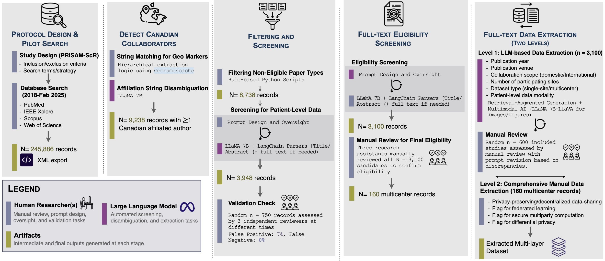

# Collaborative Research Review

This repository contains code, notebooks, and derived datasets for the manuscript **Siloed Canadian Patient Data Constrain AI Collaboration for Precision Public Health: A Scoping Review** (under review).

This repository contains the code, notebooks, and (where shareable) structured outputs used to produce our scoping review of **Canadian-affiliated medical AI studies using patient-level data**, with a focus on how multicenter collaborations share data (centralized pooling vs privacy-preserving decentralized approaches).

## At a glance
We implemented a human-in-the-loop screening + extraction workflow aligned with PRISMA-ScR, combining automated parsing with manual validation:

- **245,886** records retrieved (2018–Feb 2025), with additional searches across IEEE Xplore, ACM Digital Library, Scopus, and Web of Science  
- **9,238** records with ≥1 Canadian-affiliated author  
- **3,100** studies met inclusion criteria (patient-level data + eligibility confirmed)  
- **160** multicenter patient-level collaborations identified  
- **95%** of multicenter collaborations used **centralized pooling** (**n = 152**)  
- **5%** reported **privacy-preserving decentralized** approaches (**n = 8**)

**Quality control (built into the workflow):**
- A random subset (**n = 750**) was independently assessed by **3 reviewers**; screening error was **~7% false positives** and **0% false negatives** at that stage.
- For extraction, we additionally performed staged manual checks with prompt refinement (see “Reproducibility & audit trail” below).



**Figure 1.** Workflow of the human in the loop screening and extraction process. The diagram shows the division of labor between human reviewers and automated steps across protocol design, database search, filtering, screening, full text eligibility, and full text data extraction.

## Repository layout

- `main.ipynb`  
  Primary notebook for running the end to end workflow and generating core outputs

- `helper_pmid_pdfs.ipynb`  
  Utilities for working with PubMed IDs and full text PDFs when access is available

- `data/`  
  Intermediate and final datasets produced by the pipeline

- `validation/`  
  Manual validation materials and checks

- `clustering/`  
  Clustering analyses used for modality by domain summaries

- `external_validation_countries/`  
  Country level summaries and external validation helpers

- `html-viz/`  
  HTML based visualizations for interactive exploration

- `sql-paper-2024/`  
  SQL and related scripts used for structured analysis and paper tables

- `pg.ipynb` and `pg_data.ipynb`  
  PostgreSQL oriented workflow for storing and querying extracted features

-------------------------------------------

# Tutorial

### A) Reproduce the paper outputs from the released structured data
This path regenerates figures/tables from the curated outputs in `data/`.

**Steps**
1) Set up the environment (below)
2) Run `main.ipynb` and execute the sections that:
   - load curated datasets from `data/`
   - generate paper figures/tables/summary stats
3) Compare your regenerated counts to the “Sanity checks” section below

> If you only need to validate results/figures, this is the fastest and most deterministic path.

### B) Re-run the full pipeline end-to-end from bibliographic export
This path reruns:
- affiliation detection (Canadian collaborator detection),
- paper-type filtering,
- patient-level screening,
- full-text eligibility screening,
- high-volume feature extraction.

This audit path will require:
- access to bibliographic exports (e.g., XML),
- optional full-text PDFs depending on the extraction stage,
- local access to open-weight LLM checkpoints (if you want to reproduce LLM-assisted stages exactly).

---

## Environment setup (reproducible by design)

### Python venv
```bash
git clone https://github.com/HIVE-UofT/Collaborative_Research_Review.git
cd Collaborative_Research_Review

python -m venv .venv
source .venv/bin/activate
pip install -U pip
